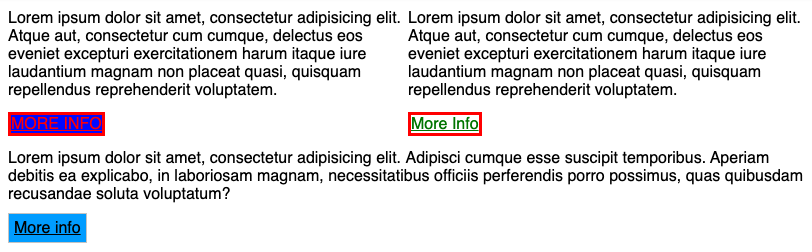

## Exercise 1 - done with the lecturer

Create one **paragraph**, set the following styles for it and test them.

```css
p {
  font-size: 12px;
}

p {
  font-size: 40px;
}
```


## Exercise 2

In the style sheet, styles are set for an element with classes `.more-info` and `.btn`, but they are overridden because of **specificity**.

Fix the selectors so that the styles work.

**Result:**




## Exercise 3

Create two **paragraphs** and one **span** element. Set a yellow (color: ```yellow```) background for all elements. You can do it any way you like.


## Exercise 4

There are 2 links on the page. One at the top has text form, the other at the bottom resembles a button. The button at the bottom has an incorrect text color (should be white). What is the reason for that? **Try to fix this problem**.

Change the color of the title in the text to `#FC0031`.
