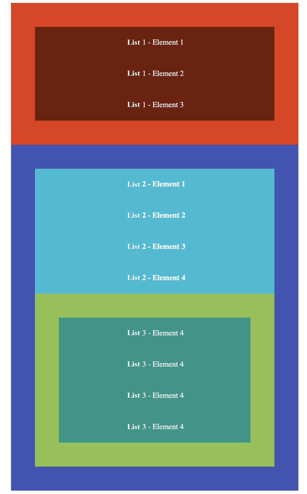

## Homework

The `index.html` file contains ready code.

**Do not change the HTML code. Just modify the CSS code!**

Style it in the following way:

- Create three global variables:
  - basic `padding` with the value `50px`
  - basic line height `35px`
  - storing the color `#8bc34a`

- Set internal margin **in all lists** to `50px` using the previously declared variable,
- For each text in each list element, set the line height to `50px` (using the `calc` method). Additionally, center this text,

- Set `#e8370e` as the background color of the first list, and `#711c08` as background color of its elements,
- Set `#3f51b5` as the background color of the second list, and `#00bcd4` as background color of its elements,
- In the third list, set the background color to the one stored in a variable, and give its elements the background color of `#009688`,

- Set white font color for the entire document,
- In the first list, set font weight to `400`,
- In the second list, set font weight to `700`,
- The third list should have font weight of `400`,
- Turn off the list element bullets.

Expected result:

