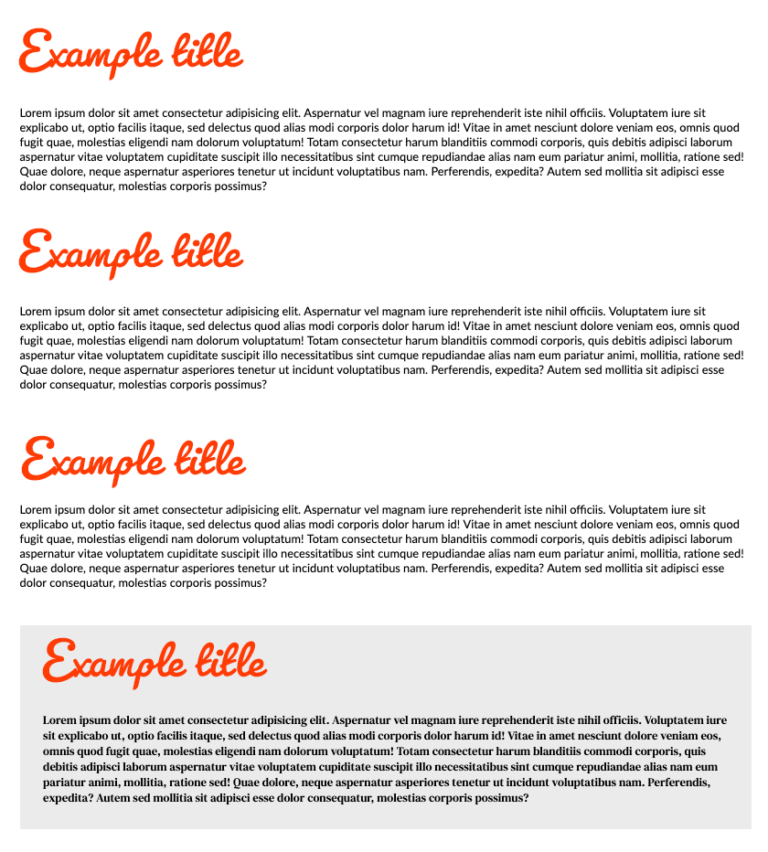

## Part 1 - done with the lecturer

- The directory `fonts` contains the file `Lato-Regular.ttf`
- At [Font Squirrel](https://www.fontsquirrel.com/tools/webfont-generator) or [Transfonter](https://transfonter.org/), go to the generator and load the font mentioned above
- Select **Optimal** and check the statement that the font has been legally downloaded
- After downloading the collection to your hard drive, unpack the archive
- Place the files with extensions `woff` and `woff2`, which are in the unpacked archive, in the folder `fonts`
- Create an appropriate `@font-face` rule in the file `css/style.css` (remember that files with fonts are in the folder `fonts`)
- Add the generated font as a style for the texts of the whole page

---

## Part 2 - to do on your own

Go to [Google Fonts](https://www.google.com/fonts) and do the following:

- using the search engine on the top, select the font **Pacifico**
- select style "Regular 400" using "Select this style" button in the middle of the screen
- on the right-hand side will appear sidebar showing chosen fonts  
- copy the link and insert it into `head` section of the page
- with `font-family` add this font to the title of all headings (`h1` - `h2`)

---

## Part 3 - to do on your own

- The directory `fonts` contains the file `DMSerifText-Regular.ttf`
- At [Font Squirrel](https://www.fontsquirrel.com/tools/webfont-generator) or [Transfonter](https://transfonter.org/) go to the generator and load the font mentioned above
- Select **Optimal** and check the statement that the font has been legally downloaded
- After downloading the collection to your hard drive, unpack the archive
- Place files with extensions `woff` and `woff2`, which are in the unpacked archive, in the folder `fonts`
- Create an appropriate `@font-face` rule (remember that files with fonts are in the folder `fonts`) in the file `css/style.css`
- Add the generated font as style for the **paragraph in the `.section--bottom` section**.

## Expected result

