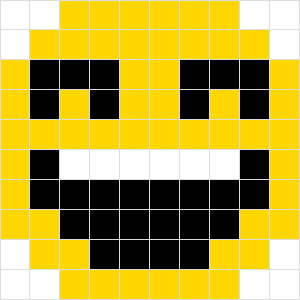

## Exercise 1 - done with the lecturer

The customer wanted the corners of the menu to be rounded. So set the corner roundness of **30px** for the first and last menu element.

Remember that `border-radius` is written clockwise, i.e. corners in the following order: `top-left top-right bottom-right bottom-left`.

Additionally, to the first `li` element - add padding of `40px` on the left side, and for the last `li` element - equally large padding on the right side.

The result should look as shown in the following image:

## Exercise 2

The client is complaining that the table is not legible - and he's right.

Improve table's appearance doing the following:
- for cells `td` of the table set **padding** to **20px**.
- make a zebra from the table, so for every second row in the table body set the background color to **#eee**.

## Exercise 3

There are 2 rows of buttons on this page.
They use [https://fontawesome.com/](https://fontawesome.com/) - vector icons that are very popular on the Internet.

When you examine the top row of buttons with the developer tools, you will see that icons are inserted into buttons as `<i>` elements.
You will not always have this possibility - for example if html will be generated by an external plugin, you may have no control over what will be generated.

Your task will be to make the same buttons with icons in the lower row (`buttons-ver-2`), but without inserting any additional tags into the buttons. So you have to use **:before** pseudo-elements here.
Using the search engine on the page: https://fontawesome.com/icons?d=gallery find the following icons: **plus-circle**, **ban**, and **play-circle**.

When you click on any of these icons, you will see its page. At the top of the page, just below the icon name, you have a piece of html code shown which you can paste into your html page to get the icon as a result (as it is done in the top row of buttons).

Right next to it, there is a unicode which you can use for pseudo-elements.

Just insert it into the content property, preceding it with a slash, that is **content: "\f04b";**. For the icon to work, the pseudo-element should also have `font-family` set to "Font Awesome 5 Free".

Knowing this, try to style the 3 bottom buttons so that they look identical to the ones above.

Styling the lower buttons by their classes, insert for each of them:
- the corresponding unicode downloaded from each icon's details subpage
- `font-family` set to "Font Awesome 5 Free"
- font size of `1.5em`

## Exercise 4

Play the game [flukeout.github.io](http://flukeout.github.io/) (Levels 15 to 26).

## Exercise 5

There's a board **.cnt**. Your task is to style this board in such a way as to obtain the same effect as shown in the image below:

**Classes and ids are not allowed** in this exercise. You are free to explore all other options as long as you achieve the described effect.
In this exercise, it is a very good idea to use a debugger, so you can check the type of individual squares.
