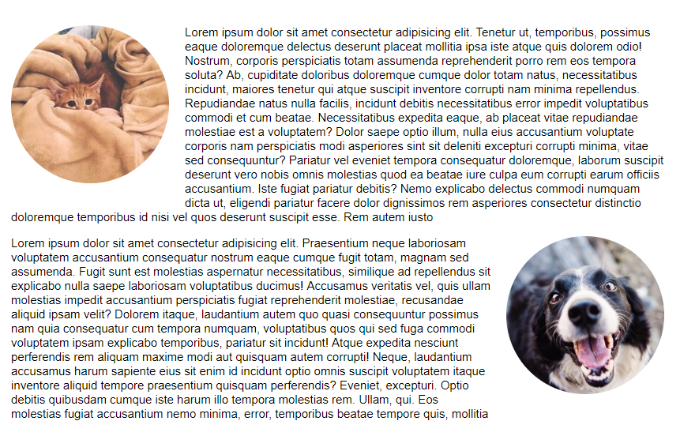
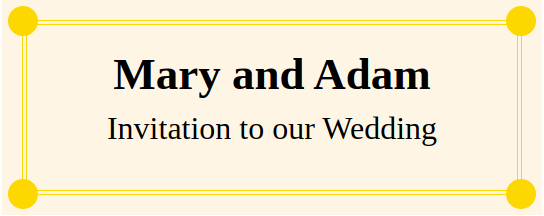
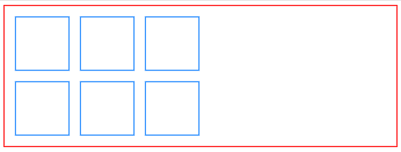
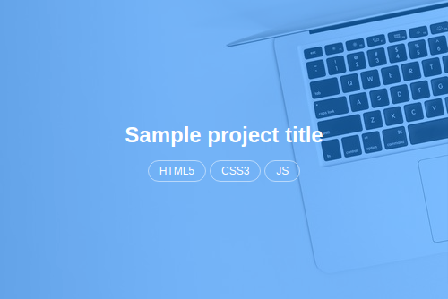

## Exercise 1 - done with the lecturer

Without affecting HTML with float and additional properties, set the following elements:

In the first paragraph:
- the photo should be positioned on the **left** side
- it should be moved away from the text by **20px** from the right and bottom
- it should be **rounded**
- it should have the size: **200x200px**

In the second paragraph:
- the photo should be positioned on the **right** side
- it should be moved away from the text by **20px** from the left and bottom
- it should be **rounded**
- it should have the size: **200x200px**

The image below shows the result:

## Exercise 2 - done with the lecturer

The `index.html` file contains an element with the class **.card**. This is a sample invitation to a wedding. There are 4 spans in it: **.dot--top-left**, **.dot--top-right**, **.dot--bottom-left** and **.fot--bottom-right**.
Style them according to class names. Every dot should have:

- background color **gold**,
- width and height **30px**,
- rounded shape,
- elements are spans. You must give them another display (e.g. block),
- they should have absolute position,
- subsequent dots should be placed in appropriate corners. For example, **.dot--left-top** should be positioned **top: -15px** and **left: -15px**

All dots should be positioned relative to the **.card__border** element.

Expected result:

## Exercise 3

In the file `index.html` there is a page with a **.container**.
Insert 6 elements with the **.element** class into it.

Each of the elements should:
- align next to other elements
- have distance **10px** on each side
- have border **2px solid dodgerblue**
- have dimensions **100x100px**

At this point, you should have 6 squares next to each other.

Using a single property, make the last 3 squares appear under the first 3.

Also note that the `container` lost its correct height. Fix it.

Expected result:

## Exercise 4

The `index.html` file contains an **.image** element. Use pseudo-elements to style this element as shown in the image below.

Pseudo-elements should be 50x50px in size and have tomato background color.
The border of the **.image** element should be 5px wide and have the tomato background color.

## Exercise 5

The file `index.html` contains a sample code of a thumbnail of a project.
Using the knowledge you have learned so far, try to make it look like this one:

The blue overlay should be positioned absolutely and have the background color **rgba(0, 128, 255, 0.5)**, but you can give it any other background (so that it looks nice!)
