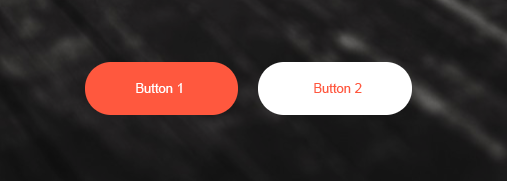

## Homework - 1

The HTML file contains a sample menu code. Your task is to style it so that it looks like the graphics below:

Guidelines for the menu:
- the background color of the menu is **#F15C5C**,
- the menu has a "Pacifico" font face with the size of **20px**. You can download this font from Google fonts.
- the distance between menu items is 20px
- internal distance in the menu is 20px
- the menu should not have an external distance
- when you hover over the link, its color changes to **#333**
- align the elements side by side with `display: inline-block`

## Homework - 2

The `index.html` file contains the code of a simple banner. Your task is to make it look like on the graphics below:

Guidelines for the banner:
- height `600px`,
- the background of the banner is the image that you will find under this path **images/car-background.jpg**,
- the font face is **Oswald**, which can be found on Google fonts,
- the text size is `60px` and thickness `600`,
- the color of the word "Sharing" is `orangered`,
- the text should be centered in both axes

After the banner is created, the background image is too bright - it needs to be darkened. To fix this, add a pseudo element `::before` for the banner. Such element should be positioned **absolutely** and cover the whole surface of the banner. Additionally, it should have the background color **#111** and transparency **0.5**.
Such an element will cover the text. Try to bring the text forward.

## Homework - 3

There are 2 buttons on this page. Your task is to style them as in the graphics below:

Styling guidelines:

- the buttons shouldn't have frame,
- the buttons should have a "hand" as cursor,
- The internal distance of the buttons is:
  `20px` top and bottom,
  `50px` left and right,
- The rounding of the corners is `35px`,
- the red color used for the buttons is **tomato**,
- the distance between the buttons should be at least **10px**
