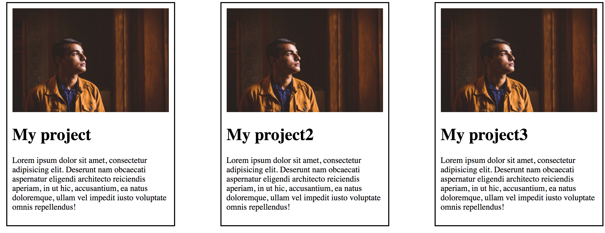

## Box with user - done with the lecturer

Use flexbox to create the following element on the website:

Guidelines:

* The image is centered vertically relative to the text
* Button `Send message` is in the bottom right-hand corner of the box (use flexbox).

## Holy Grail - done with the lecturer

The Holy Grail in CSS is not a famous chalice, but a problem that has given wrinkles to more than one developer in the past.

The problem was to create a fully working layout that would be based on equal columns.

Making such a layout using floats was quite a challenge and showed whether the person had reached the true Jedi level in CSS.

Your goal is to make a layout as shown below (without the texts that describe the elements) using flexbox:

## Flexbox Froggy

Finish the Flexbox Froggy game, which you can find under this link: [https://flexboxfroggy.com/](https://flexboxfroggy.com/)

## Navigation

Using your knowledge of how to arrange elements on the page, create the following page layout.

Guidelines:

* Use flexbox to align the elements side by side
* Logo and navigation must be scattered (i.e. be as far apart as possible from each other)
* Logo and navigation must be at the center of the header (vertically centered)

Additional information:

* background color: #E53C3D
* text color: #492F41

## Project boxes

Create the following section using flexbox:

## Fiery circles

The next task is to recreate the image below:

In html, create an element `.circles` (e.g. section) and place 6 circles (e.g. as divs) in it.
Each circle should have:

- size `150x150`
- vertically and horizontally centered text (using flexbox) of the size `40px`
- distance from other circles `10px`
- gradient background changing from red to the color `#FBB921`

**The circles should be centered horizontally and wrap (fall one under the other) if they do not fit horizontally.**
