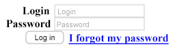
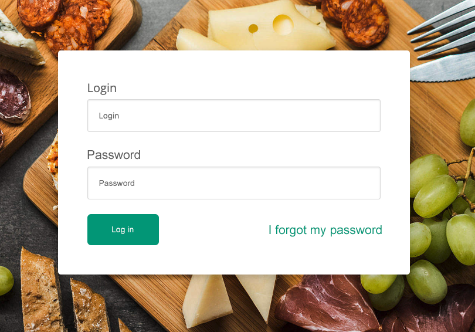

## Exercise done with the lecturer

Create a form with the following fields:
- Login
  - Placeholder "Login"
  - "Login" label
  - Type `text`
- Password
  - Placeholder "Password"
  - "Password" label
  - Type `password`
- "Login" button
  - `Button`
  - Type `submit`
- Link "I forgot my password"

Do not add any styles to the form!

Expected result:

---

## Exercises to do on your own

Your task is to make the form look as shown in the image below:

**You can add appropriate classes to the structure created earlier to make it easier for you to style the whole thing!**

#### Part 1

Start with the background and centering the form.

Give the `body` element the following properties:
- background is an image that can be found in the `images/background.jpg`
- background size big so as to cover the **entire area**
- **centered** background
- background **should not repeat**

Additionally, make sure that the form on the website is centered. Give flex to the body and center the body content in 2 axes.

---

#### Part 2

Another element will be the form. Give it the following properties:

- white background,
- roundness of corners **4px**
- shadow **0 3px 10px rgba(0, 0, 0, 0.2)**
- inner distance from the edge **40px**

---

#### Part 3

Now, correct inputs by assigning the following properties to them:

- inner distance **15px**
- frame **1px** thick, **solid**, with color **#ddd**
- roundness of corners **3px**
- **internal** shadow **0 1px 2px rgba(0, 0, 0, .1)**
- display **block**
- width **400px**
- using box-sizing property make the padding not expand the element (because you gave it 100% above)

---

#### Part 4

The next element is the login button.

Add the following properties to the `button` element:

- background color **#05A081**
- internal distance **15px 30px**
- display **inline-block**
- text color **white**
- no border
- rounding of corners **5px**

---

#### Part 5

The last thing to do is to arrange the "I forgot my password" link on the other side of the form.

For the last row, add **flex** display, then:
- in the main axis, scatter elements at the two ends of this axis
- center elements in the additional (vertical) axis

---

**When you're done with the above tasks, add extra styles to make your form look even better!**

e.g. font face, settings of elements, etc.
