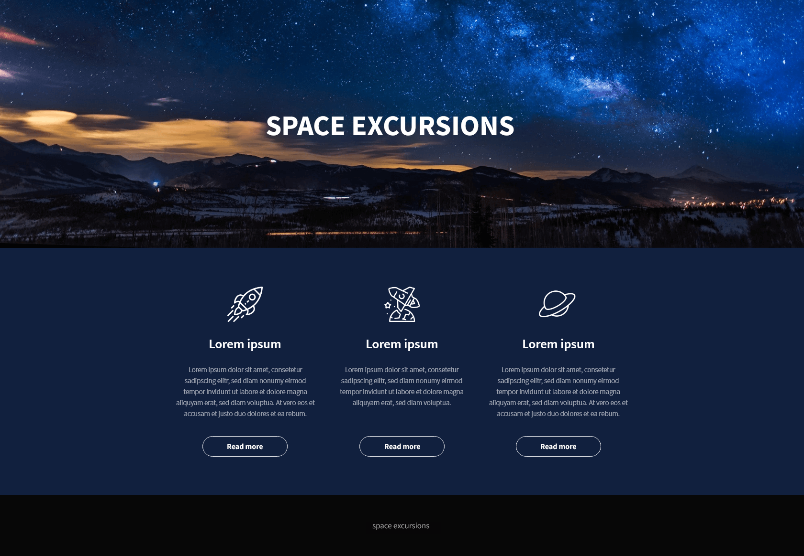

## Exercise 1 - done with the lecturer

### The content of this exercise is in the previous presentation!

## Exercise 2

Below you have a view of the layout you have to prepare:

The image below shows helpful information about the project:

**Layout information:**
- The project uses Source Sans Pro which you can find on [Google Fonts](https://fonts.google.com/specimen/Source+Sans+Pro)
- The background of the page is full width, while content width is `930px`
- The icons above the texts are in the catalog `bootstrap/images`
- The image used in the banner is `bg.jpg` located in the `bootstrap/images` directory.
- The background color of the page is `#11203E`
