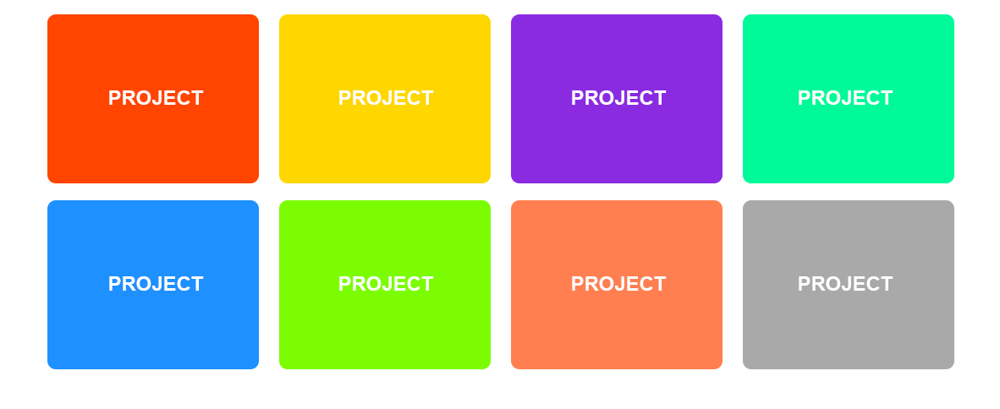
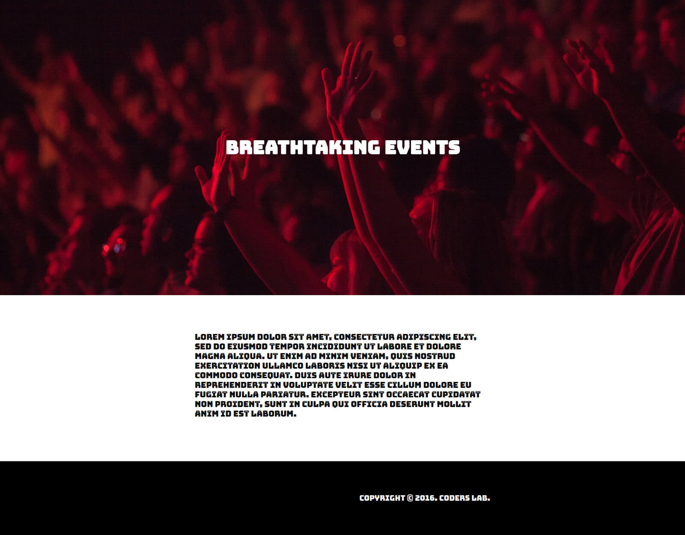

## Homework - Colored tiles

The file `index.html` contains a sample code of a mini gallery with projects.
Your task is to make it look like this:



Guidelines for the exercise:
- components have dimensions `250x200`,
- elements have rounded corners of `10px`
- text in the elements is written in `sans-serif`, size `20px`, white color.
- If they have enough space, they should appear next to each other. As we shrink the browser window, they should be falling to the next rows.

Colors of the successive elements are:
- orangered
- gold
- blueviolet
- mediumspringgreen
- dodgerblue
- lawngreen
- coral
- darkgray


## Flexbox Defense

Finish the Flexbox Defense game which you can find at the link: [http://www.flexboxdefense.com/](http://www.flexboxdefense.com/).


## Homework

Create the page as shown in the attached image:



* Start by resetting all browser-dependent CSS properties (simple reset is enough).
* Attach the font [Bungee Inline](https://fonts.google.com/specimen/Bungee+Inline). Connect the font family directly from Google Fonts.
* Add 3 elements to body:
    * ```header```
    * ```section```
    * ```footer```
* Create a __container__ class. Set its width to ```800px``` and make it always centered horizontally.
* Set width ```100%``` and height ```700px``` for  the component ```header``` and use __concert.jpg__ from the __images__ directory as a background.
* Let the background in the ```header``` element always be centered and always stretch appropriately to cover the whole element (use appropriate values for ```background-size``` and ```background-position```).
* Place text inside the ```header``` element (use the appropriate semantic element), center it vertically and horizontally relative to the parent and give it appropriate properties:
    * font weight ```700```,
    * font size ```50px```,
    * color ```#FFFFFF```
* Set width ```100%``` and background color ```#FFFFFF``` for the ```section``` element.
* There is text in the __text.txt__ file that should be placed inside the ```section``` element.
* Note that the text in the ```section``` element must be constrained by the corresponding element with the class __container__.
* Move the text away from top and bottom by ```100px``` and give appropriate properties to it:
    * Font weight ```400```,
    * font size ```22px```,
    * line height ```26px```
* Set width ```100%``` and height ```200px``` and background color ```#000000``` for the ```footer``` element.
* The text in the ```footer``` element is centered vertically and shifted to the right as far as possible (note that it is limited by the element with the class __container__).
* The text in the ```footer``` element has the following properties:
    * font weight ```400```,
    * font size ```20px```,
    * font color ```#FFFFFF```.
